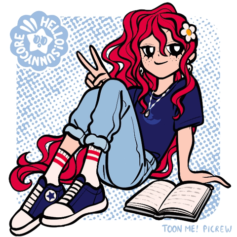
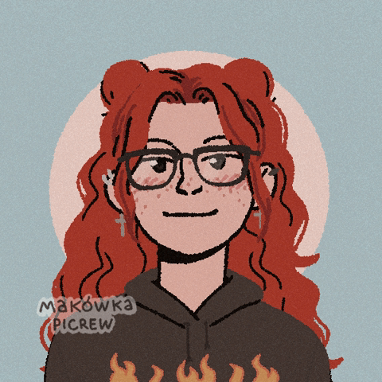
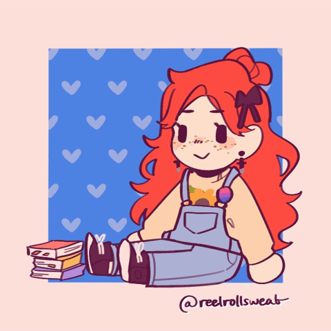

# Hello! I am Giovanna Portal 😊

- 👩‍💻 I am a "Análise e Desenvolvimento de Sistemas" student (analysis and systems development)
- 💻 I also intend to study "Ciência da Computação" (Computer Science)
- 🏳‍🌈 I go by She/Her pronouns.
- ✌ I am a Brazilian girl

;
;
;

<link rel="stylesheet" href="css.css">

# Hello! I am Giovanna Portal 😊

- 👩‍💻 I am a "Análise e Desenvolvimento de Sistemas" student (analysis and systems development)
- 💻 I also intend to study "Ciência da Computação" (Computer Science)
- 🏳‍🌈 I go by She/Her pronouns.
- ✌ I am a Brazilian girl

### Where to find me 📱

### GitHub Stats 📊

### My main challenges/projects at DIO  👾

